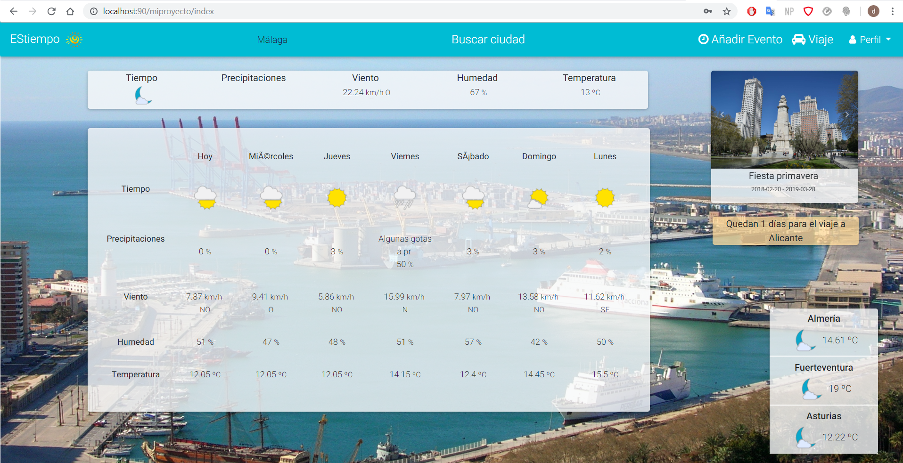
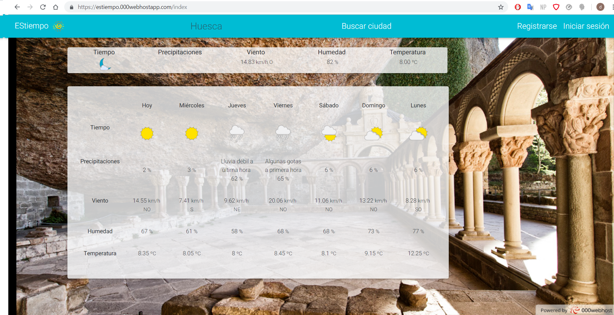
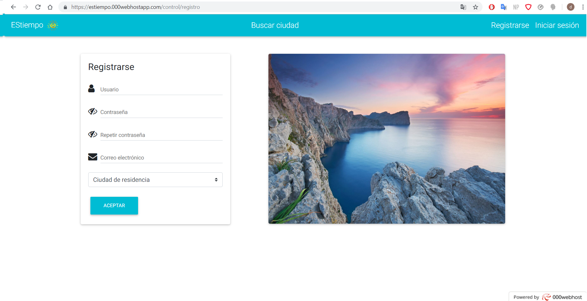

# ESTiempo ☀️

_Aplicacion Web del tiempo en España_

Realizada por David Balsas Martín para proyecto de Desarrollo Web en Entorno Servidor en IES Campanillas, Málaga

## Explicación 📜

*Aplicación del tiempo en España* que además de mostrar el tiempo, permite funciones como _crear usuario_, _modificarlo_, _añadir ciudades predeterminadas o de residencia_, _crear y visualizar eventos_, _planificar un viaje_.

Tiene una interfaz muy amigable.

[Ver resultado online](https://estiempo.000webhostapp.com/)

### ¿Qué se ha utilizado? 📋

* *PHP*
* *Mysql*
* *CSS3*
* *HTML5*
* *Javascript*
* *MDBootstrap*

## Alguna captura 📷

### Index de usuario logueado en localhost

### Buscar una ciudad en localhost

### Buscar ciudad en servidor remoto

### Registrar usuario en servidor remoto

